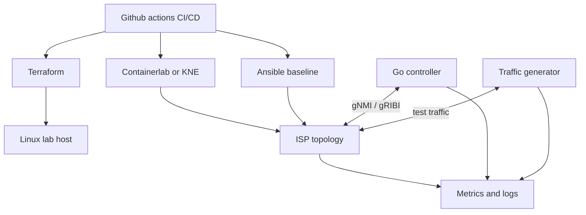
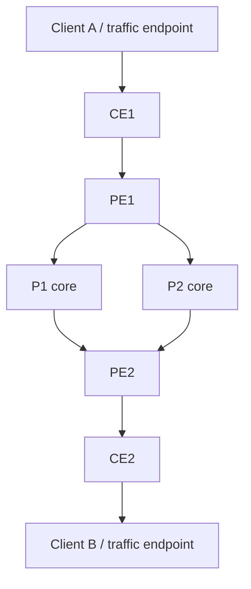
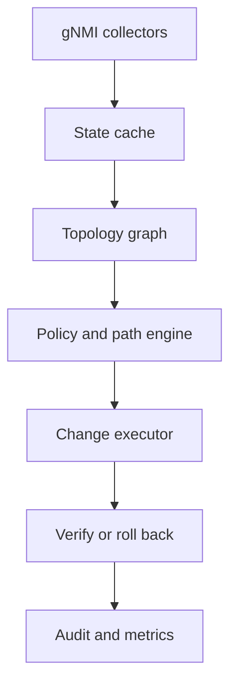
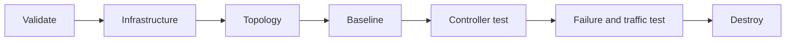

# Ohtli

# Open ISP Lab: Terraform, Ansible, gNMI, Telemetry, and Traffic Generation

## 1. Objective

Build a repeatable ISP-style network lab without Cisco Modeling Labs (CML). The platform will:

- provision the lab infrastructure with Terraform;
- create a redundant provider topology using containerized or virtual network operating systems;
- apply baseline device configuration with Ansible;
- let a controller read telemetry and program devices through gNMI;
- optionally use gRIBI or P4Runtime for direct forwarding-plane programming;
- collect, process, visualize, and retain telemetry and controller logs;
- generate repeatable traffic to validate reachability, capacity, loss, latency, and convergence;
- run from Github Actions CI/CD and clean up predictably.

The first milestone should demonstrate closed-loop automation safely: observe a link failure, calculate the impact, apply an authorized change, verify the result, and record an audit trail.

## 2. Recommended architecture



Use a separate management network for SSH, gNMI, logging, and automation. Test traffic should traverse data-plane interfaces, never the management network.

### Responsibility boundaries

| Layer | Recommended tool | Responsibility |
|---|---|---|
| Infrastructure | Terraform | VM/host, cloud networking, firewall rules, storage, SSH keys |
| Lab topology | Containerlab initially; KNE later | Nodes, links, management addressing, lifecycle |
| Baseline configuration | Ansible | Users, certificates, interfaces, routing protocols, telemetry service |
| Dynamic control | Go controller | Subscribe, decision logic, authorized gNMI/gRIBI changes, verification |
| Traffic | iperf3 initially; TRex for scale | Generate flows and measure loss, rate, latency, and convergence |
| Observability | Prometheus, Loki, Grafana | Metrics, logs, dashboards, alerts |
| CI/CD | Github CI | Validation, deployment, testing, artifacts, cleanup |

Terraform should create the infrastructure on which the lab runs. Containerlab or KNE should own the network-node topology and virtual links; expressing every virtual cable as a Terraform resource adds complexity without useful lifecycle control.

## 3. ISP topology

Start with two customer edges, two provider edges, and two redundant core routers. This is large enough to test BGP policy and convergence but still small enough for a laptop or modest VM.



For the first iteration, the clients may connect directly to the PEs, reducing the lab to six containers. Add CE routers when testing customer routing policy, VRFs, MPLS, or SRv6.

### Suggested address plan

| Purpose | Prefix | Example use |
|---|---|---|
| Management | `172.20.20.0/24` | SSH, gNMI, monitoring |
| Router loopbacks | `10.255.0.0/24` | Router IDs and BGP update sources |
| Point-to-point links | `10.0.0.0/24`, split into `/31` links | Provider adjacencies |
| Customer A | `192.0.2.0/24` | Documentation/test prefix |
| Customer B | `198.51.100.0/24` | Documentation/test prefix |

### Protocol roadmap

1. Use OSPF or IS-IS as the provider underlay.
2. Establish iBGP between provider nodes, using loopbacks.
3. Use eBGP between CE and PE devices.
4. Add BGP policy, communities, local preference, and MED tests.
5. Add VRFs and MPLS L3VPN or SRv6 only after the basic failure tests are stable.

OSPF or IS-IS already provides fast distributed recovery. In the first controller milestone, observe and measure native convergence instead of trying to replace it. Later, the controller can tune metrics through gNMI or install selected routes through gRIBI.

## 4. Network operating system choices

No single choice is simultaneously a complete router OS, fully open source, resource-light, and guaranteed to expose a full OpenConfig gNMI implementation. Select the image based on what is being tested.

| Option | Strength | Limitation | Best use |
|---|---|---|---|
| FRRouting in Linux containers | Open source, light, mature routing protocols | Not a complete OpenConfig gNMI target by itself | Routing and CI foundation |
| SONiC virtual switch | Open source NOS and switching stack | gNMI behavior depends on image and enabled services | Switch/NOS testing |
| Stratum + BMv2 | Open source, programmable, gNMI plus P4Runtime | More development-oriented than conventional ISP routing | Controller and forwarding experiments |
| Open vSwitch | Mature open-source virtual switching | Primarily OVSDB/OpenFlow, not OpenConfig gNMI | Data-plane integration |
| Nokia SR Linux container | Excellent model-driven gNMI lab experience | Free for labs but not fully open source | Fastest gNMI-first prototype |
| VyOS | Familiar router behavior | Image building, licensing, and APIs require verification | VM-based router labs |

Recommended approach:

- Build the infrastructure, topology, Ansible, CI, traffic, and observability path with FRRouting first.
- Use SR Linux when the immediate priority is a working OpenConfig/gNMI control loop.
- Add SONiC or Stratum when strict open-source NOS or P4 programmability is a requirement.
- Keep the controller's device adapter layer separate so NOS-specific paths do not leak into policy logic.

Containerlab supports containerized NOS images, Linux containers, and VM-based images, and is designed for declarative network labs and CI workflows. For a Kubernetes-native environment, [KNE](https://github.com/openconfig/kne) provides topology and lifecycle management on Kubernetes.

## 5. Infrastructure plan

### Terraform scope

Terraform should provision:

- one Ubuntu lab VM initially, or a small Kubernetes cluster later;
- CPU, RAM, storage, and nested virtualization when VM-based NOS images require it;
- management subnet and controlled ingress rules;
- SSH keys and instance identity;
- attached storage for images and telemetry data;
- outputs consumed by Github and Ansible.

Suggested starting capacity for the six-to-eight-node container lab is 8 vCPU, 16 GB RAM, and 80 GB storage. VM-based commercial NOS images usually need substantially more memory and CPU; size after measuring actual images.

Terraform outputs should include the lab host IP, SSH user, topology name, and generated inventory inputs. Do not put passwords or private keys in Terraform output or Git history.

### Topology lifecycle

Use [Containerlab](https://containerlab.dev/) for the first implementation:

```bash
containerlab deploy --topo topology/isp.clab.yml
containerlab inspect --topo topology/isp.clab.yml
containerlab destroy --topo topology/isp.clab.yml --cleanup
```

A simplified FRR node pattern is:

```yaml
name: isp-lab

topology:
  defaults:
    kind: linux
    image: frrouting/frr:stable
  nodes:
    pe1: {}
    p1: {}
    p2: {}
    pe2: {}
    client-a:
      image: networkstatic/iperf3:latest
    client-b:
      image: networkstatic/iperf3:latest
  links:
    - endpoints: ["pe1:eth1", "p1:eth1"]
    - endpoints: ["pe1:eth2", "p2:eth1"]
    - endpoints: ["p1:eth2", "pe2:eth1"]
    - endpoints: ["p2:eth2", "pe2:eth2"]
    - endpoints: ["client-a:eth1", "pe1:eth3"]
    - endpoints: ["client-b:eth1", "pe2:eth3"]
```

Treat this as a skeleton. Confirm the selected image's startup command, required capabilities, configuration mount, and interface naming before committing the topology.

## 6. Ansible configuration model

Ansible owns intended baseline configuration:

- hostnames, users, SSH, NTP, and DNS;
- management and data-plane interface addresses;
- loopbacks and router IDs;
- OSPF/IS-IS and initial BGP sessions;
- gNMI service enablement, certificate trust, and authorization;
- logging and telemetry destinations.

Generate inventory from Terraform and Containerlab outputs. Keep common variables in `group_vars` and per-node addresses/router IDs in `host_vars`.

### Avoid conflicting owners

| Configuration/data | Owner |
|---|---|
| Interfaces and routing-process baseline | Ansible |
| Native routing state | Network OS protocols |
| Dynamic controller policy | Controller |
| Controller-injected routes | gRIBI/P4Runtime client |
| Dashboards and alert rules | Observability deployment |

Do not let Ansible and the controller continuously manage the same leaf configuration. Do not let native routing and gRIBI own the same prefixes without explicit preference and failover rules.

Make playbooks idempotent and avoid destructive patterns such as removing the entire routing process before recreating it. Validate variables first, configure incrementally, wait for adjacencies, and verify reachability before advancing the pipeline.

## 7. Controller design

Go is a strong default for the controller because the OpenConfig ecosystem and gRPC support are mature. Useful libraries include:

- [`openconfig/ygnmi`](https://github.com/openconfig/ygnmi) for typed gNMI operations;
- [`openconfig/ygot`](https://github.com/openconfig/ygot) for YANG-generated Go structures;
- [`openconfig/gribigo`](https://github.com/openconfig/gribigo) for gRIBI;
- [`grpc-go`](https://github.com/grpc/grpc-go) for gRPC transport.

The [gNMI specification](https://www.openconfig.net/docs/gnmi/gnmi-specification/) defines `Capabilities`, `Get`, `Set`, and `Subscribe`. Use `Subscribe` for continuous state and `Set` for configuration supported by the target. Use gRIBI when the goal is direct route/forwarding entry programming rather than configuration changes. Use gNOI for operational actions such as certificate or system operations when supported.

### Controller components



Recommended internal packages:

```text
controller/
├── cmd/controller/
├── internal/devices/
├── internal/gnmi/
├── internal/gribi/
├── internal/telemetry/
├── internal/topology/
├── internal/policy/
├── internal/reconcile/
├── internal/audit/
└── tests/
```

### Initial telemetry paths

Use OpenConfig paths where the NOS supports them:

- `/interfaces/interface/state/oper-status`
- `/interfaces/interface/state/counters`
- `/network-instances/network-instance/protocols`
- `/network-instances/network-instance/afts`
- `/components/component/state`

Confirm actual paths with the device's `Capabilities` RPC. Vendors may support only subsets or augment the models.

### Reconciliation flow

1. Establish mTLS gNMI sessions.
2. Read capabilities and validate required models/encodings.
3. Subscribe to interface, routing, adjacency, and counter state.
4. Normalize updates into a device-independent cache.
5. Build a graph containing nodes, links, metrics, and health.
6. Debounce transient failures and confirm the condition.
7. Calculate an alternative path using Dijkstra or constrained SPF.
8. Validate the proposed change against policy and ownership rules.
9. Apply a gNMI `Set`, gRIBI operation, or P4Runtime update.
10. Verify intended and operational state.
11. Roll back or withdraw the change if verification fails.
12. Emit structured logs, metrics, and an immutable audit event.

Use the following explicit state machine:

```text
Healthy -> Suspect -> ConfirmedFailure -> RemediationPending
        -> Remediating -> Verifying -> Recovered
                                  \-> Rollback
```

Begin with approval-gated writes. Enable unattended remediation only after replayable tests demonstrate deterministic validation and rollback.

## 8. Logging, telemetry, and processing stack

### MVP stack

| Component | Purpose |
|---|---|
| gNMI subscriptions or gNMIc | Device streaming telemetry |
| Prometheus | Controller, traffic, and derived time-series metrics |
| Loki | Structured controller and device logs |
| Grafana | Dashboards and correlated investigation |
| OpenTelemetry SDK/Collector | Standard traces, metrics, and log export |

The controller should log JSON to stdout with fields such as timestamp, device, path, event type, correlation ID, old value, new value, operation, outcome, and duration. Never log credentials or private-key material.

Expose controller metrics including:

- gNMI session status and reconnect count;
- subscription update delay;
- interface and adjacency changes;
- events queued and processed;
- remediation attempts and failures;
- gNMI/gRIBI request latency;
- time to detect and time to recover;
- observed traffic loss and convergence time.

If processing volume grows beyond a single controller, insert NATS JetStream or Kafka between collectors and processors. For the initial lab, direct processing plus Prometheus/Loki is simpler and easier to operate. Add PostgreSQL/TimescaleDB only when long-term event or telemetry queries exceed Prometheus retention needs.

## 9. Traffic generation

Use existing tools before building a custom generator.

### Recommended progression

| Stage | Tool | Why |
|---|---|---|
| Initial functional tests | [iperf3](https://software.es.net/iperf/) | Lightweight TCP/UDP/SCTP testing, JSON output, easy container endpoints |
| Repeatable multi-flow/load tests | [Cisco TRex](https://trex-tgn.cisco.com/) | Open-source, DPDK-based, stateless/stateful traffic, latency and jitter measurements |
| Custom packet crafting/replay | [Ostinato](https://ostinato.org/) or Scapy | Protocol-specific frames, PCAP replay, malformed or edge-case traffic |
| Controller-specific test agent | Small Go sender/receiver | Exact event correlation and application-defined measurements |

For the MVP, run an iperf3 server at Client B and a client at Client A. Use UDP with a fixed rate for loss and convergence measurements, and TCP for achievable throughput. Save `--json` output as a github artifact.

Example:

```bash
# Client B
iperf3 --server --one-off

# Client A: 60-second UDP flow at 100 Mbit/s with JSON results
iperf3 --client 198.51.100.2 --udp --bitrate 100M --time 60 --interval 1 --json
```

Move to TRex when testing many flows, high packet rates, realistic packet distributions, latency, or jitter. Dedicate suitable CPU cores and NIC queues to TRex; DPDK performance tests are sensitive to CPU pinning, hugepages, NUMA placement, and virtual NIC type.

### When to create a custom generator

Only build one when existing tools cannot express the required controller test. A minimal Go traffic agent can send UDP packets containing:

- flow ID;
- monotonically increasing sequence number;
- send timestamp;
- test/correlation ID.

The receiver calculates loss, reordering, one-way delay when clocks are synchronized, outage duration, and recovery time. Export Prometheus metrics and JSON summaries. Keep this agent as a measurement tool, not a general replacement for TRex.

## 10. GitHub CI/CD design



Suggested jobs:

1. `validate`
   - YAML lint, Ansible lint, Go tests, Terraform formatting/validation, topology validation.
2. `terraform-plan`
   - create a reviewable plan artifact.
3. `terraform-apply`
   - protected branch or manual approval for persistent infrastructure.
4. `topology-deploy`
   - deploy Containerlab and record node/interface inventory.
5. `ansible-baseline`
   - apply idempotent configuration and wait for routing convergence.
6. `controller-smoke`
   - verify TLS, capabilities, `Get`, and `Subscribe` on every node.
7. `traffic-baseline`
   - validate end-to-end throughput, latency, and loss.
8. `failure-test`
   - disable one core link, capture routing/controller events, and measure convergence.
9. `restore-and-verify`
   - restore the link and verify all nodes and traffic.
10. `cleanup`
    - always collect logs/artifacts; destroy ephemeral topology even after test failure.

Use github masked/protected variables or a secret manager for credentials and certificates. Pin container images, Terraform providers, Ansible collections, and Go dependencies. The previous Ansible 2.9 failures are a warning that the CI image is too old for current collection-qualified modules; build a controlled image with tested versions and verify it in the validation job.

## 11. Repository structure

```text
isp-lab/
├── terraform/
│   ├── modules/
│   └── environments/lab/
├── topology/
│   ├── isp.clab.yml
│   └── configs/
├── ansible/
│   ├── inventories/lab/
│   ├── group_vars/
│   ├── host_vars/
│   ├── roles/
│   └── playbooks/
├── controller/
│   ├── cmd/
│   ├── internal/
│   └── tests/
├── traffic/
│   ├── iperf/
│   ├── trex/
│   └── custom-agent/
├── observability/
│   ├── prometheus/
│   ├── loki/
│   ├── grafana/
│   └── otel/
├── tests/
│   ├── smoke/
│   ├── convergence/
│   └── failure/
├── docs/
└── .github-ci.yml
```

## 12. Phased implementation plan

### Phase 0: Decisions and constraints

- Choose the initial NOS: FRR for an open routing foundation or SR Linux for the fastest gNMI-first result.
- Confirm available CPU/RAM and whether VM images are acceptable.
- Define the supported OpenConfig paths and controller write scope.
- Define success thresholds for loss, convergence, and recovery.

### Phase 1: Reproducible infrastructure

- Provision one Linux lab VM with Terraform.
- Install Docker/Podman and Containerlab through pinned automation.
- Deploy the redundant provider topology.
- Export inventory and management endpoints.

Exit criterion: a fresh runner can create and destroy the same topology without manual device changes.

### Phase 2: Baseline routing

- Apply interface, loopback, OSPF/IS-IS, and BGP configuration with Ansible.
- Validate every adjacency and advertised prefix.
- Run bidirectional ping and iperf3 tests.

Exit criterion: traffic uses the preferred path and reroutes through the backup path when a core link fails.

### Phase 3: Read-only controller

- Implement mTLS, device registry, capabilities discovery, and gNMI subscriptions.
- Normalize state and construct the topology graph.
- Export metrics and structured logs.
- Measure native routing convergence during controlled failures.

Exit criterion: controller-reported state matches CLI/device state, with complete timestamped evidence.

### Phase 4: Controlled writes

- Add dry-run and approval modes.
- Change one safe parameter, such as an interface description or IGP metric, with gNMI.
- Read back configuration and operational state.
- Implement rollback and idempotency.

Exit criterion: the controller can apply, verify, and revert an authorized change consistently.

### Phase 5: Forwarding control and scale

- Add gRIBI or P4Runtime for selected routes when supported.
- Introduce TRex and multi-flow tests.
- Add event streaming only if measured load requires it.
- Expand to VRFs, MPLS, SRv6, or larger topologies.

Exit criterion: policy-driven changes improve a defined test outcome without conflicting with native routing ownership.

## 13. Acceptance tests

The MVP is complete when all of the following are automated:

- Terraform provisions the lab host and emits usable outputs.
- Containerlab deploys the topology and management reachability succeeds.
- Ansible completes twice with the second run reporting no unintended changes.
- All intended IGP and BGP adjacencies are established.
- The controller successfully runs gNMI `Capabilities`, `Get`, and streaming `Subscribe` against every intended target.
- Continuous traffic crosses the primary path.
- A core-link failure is detected, traffic reroutes, and packet loss/outage duration are measured.
- The controller records detection, decision, action, and verification with one correlation ID.
- The failed link is restored and the network returns to the intended state.
- Logs, metrics, traffic results, configurations, and test reports are retained as CI artifacts.
- Cleanup runs even when a preceding test fails.

## 14. Security and operational safeguards

- Use mTLS for gNMI and least-privilege authorization for controller identities.
- Separate read-only telemetry credentials from configuration credentials.
- Place management services on an isolated network or VRF.
- Store secrets outside the repository and redact them from logs.
- Require explicit device/path allowlists for controller writes.
- Use candidate/dry-run checks where supported.
- Rate-limit remediation and prevent repeated oscillating changes.
- Back up known-good configuration and maintain a tested rollback path.
- Record who or what initiated every write.
- Never expose gNMI, SSH, Prometheus, or Grafana directly to an untrusted network.

## 15. Principal risks

| Risk | Mitigation |
|---|---|
| NOS lacks required OpenConfig paths | Test `Capabilities` early; maintain device adapters |
| Conflicting control owners | Enforce the ownership table and prefix/path allowlists |
| False failure triggers | Debounce events and require multiple signals |
| CI image/version drift | Pin and test all dependencies in a purpose-built runner image |
| Lab resource exhaustion | Start small, collect utilization, add capacity deliberately |
| Traffic results distorted by virtualization | Pin CPU, document virtual NICs, and separate functional from performance claims |
| Unsafe controller changes | Dry run, approval gates, staged rollout, verification, automatic rollback |

## 16. Immediate next steps

1. Select FRR or SR Linux for the first three milestones.
2. Create the repository skeleton and a pinned github runner image.
3. Write Terraform for one Ubuntu lab host.
4. Implement and validate the six-node Containerlab topology.
5. Build idempotent Ansible roles for addressing, OSPF/IS-IS, BGP, and gNMI security.
6. Add two iperf3 endpoints and establish a baseline test.
7. Build a read-only Go controller using `Capabilities`, `Get`, and `Subscribe`.
8. Deploy Prometheus, Loki, Grafana, and OpenTelemetry collection.
9. Automate one link-failure experiment and calculate detection and recovery times.
10. Add the first approval-gated gNMI write only after the read-only results are reliable.

## References

- [Containerlab documentation](https://containerlab.dev/)
- [Kubernetes Network Emulation (KNE)](https://github.com/openconfig/kne)
- [OpenConfig gNMI specification](https://www.openconfig.net/docs/gnmi/gnmi-specification/)
- [OpenConfig RPC overview: gNMI, gNOI, and gRIBI](https://openconfig.net/rpc/)
- [OpenConfig gNMI authentication](https://openconfig.net/docs/gnmi/gnmi-authentication/)
- [gNMIc documentation](https://gnmic.openconfig.net/)
- [Cisco TRex traffic generator](https://trex-tgn.cisco.com/)
- [iperf3 documentation](https://software.es.net/iperf/)
- [Ostinato traffic generator](https://ostinato.org/)
